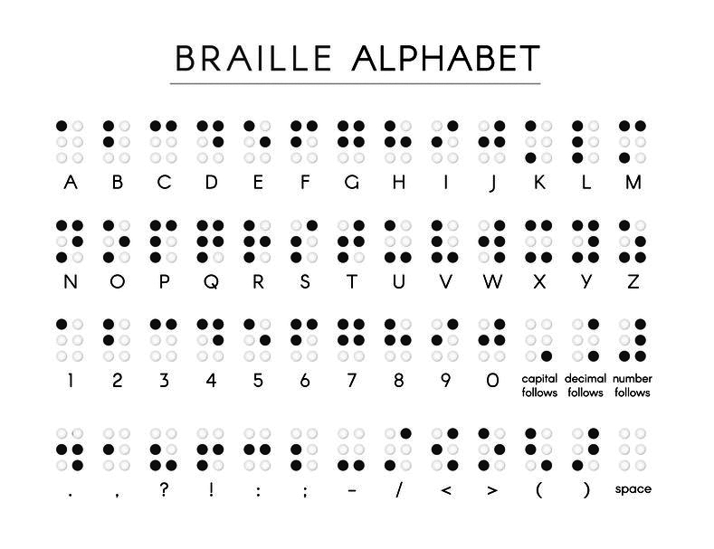

# Eng Intern Challenge Fall 24

## Braille Translator
In this coding challenge you will create a terminal / command-line application that can translate Braille to English and vice versa. The string to translate will be passed into your application as an argument at runtime. Your application must be smart enough to determine if the string given to it is either Braille or English and automatically convert it to the appropriate opposite. For the purposes of this challenge Braille must be displayed as a series of the characters `O` and `.`. You must include the entire English alphabet, the ability to `capitalize` letters, as well as numbers `0` through `9`. After converting the string, the output of your app must be said converted string and nothing else. 

## What is Braille?
Braille (*/breɪl/ **BRAYL***) is a tactile writing system used by people who are visually impaired. Braille characters are formed using a combination of six raised dots arranged in a 3 × 2 matrix, called the braille cell. The number and arrangement of these dots distinguishes one character from another. ([via Wikipedia](https://en.wikipedia.org/wiki/Braille))

## Technical Requirements
- Translator
  - Given an argument passed into the program at runtime, determine if the given string should be translated to English or Braille.
  - For Braille, each character is stored as a series of `O` or `.`
  - You may store this as a 3x2 array or as a string reading right to left, line by line. See examples below.
- Braille Alphabet
  - Letters `a` through `z`
    - The ability to capitalize letters
  - Numbers `0` through `1`
  - The ability to include `spaces` ie: multiple words

## Examples
- Launching your application:
  - `ruby translator.rb "Hello world"`
  - `ruby translator.rb ".....OO.OO..O..O..O.O.O.O.O.O.O..OO........OOO.OO..OO.O.OOO.O.O.O.OO.O.."`

- Input: `Hello world`
- Output: `.....OO.OO..O..O..O.O.O.O.O.O.O..OO........OOO.OO..OO.O.OOO.O.O.O.OO.O..`
- Input: `42`
- Output: `.O.OOOOO.O..O.O...`
